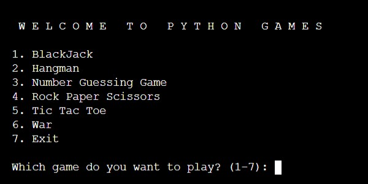
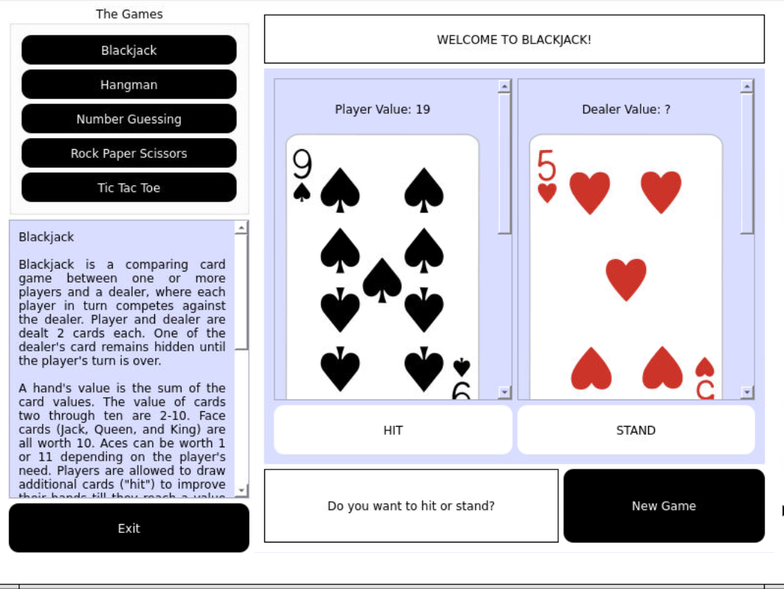
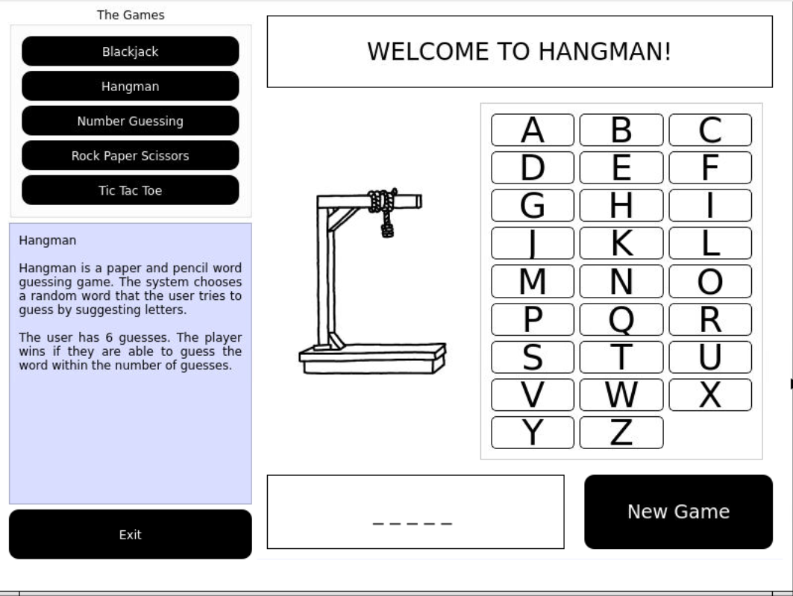
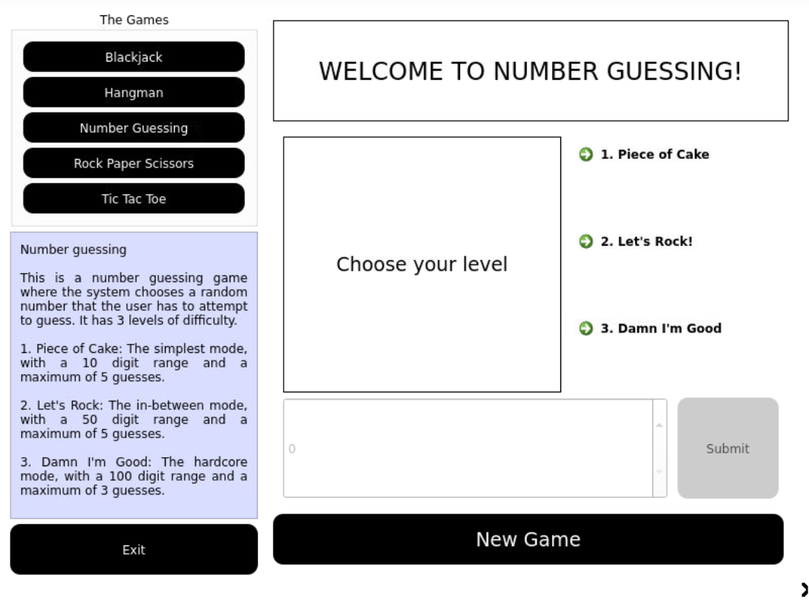
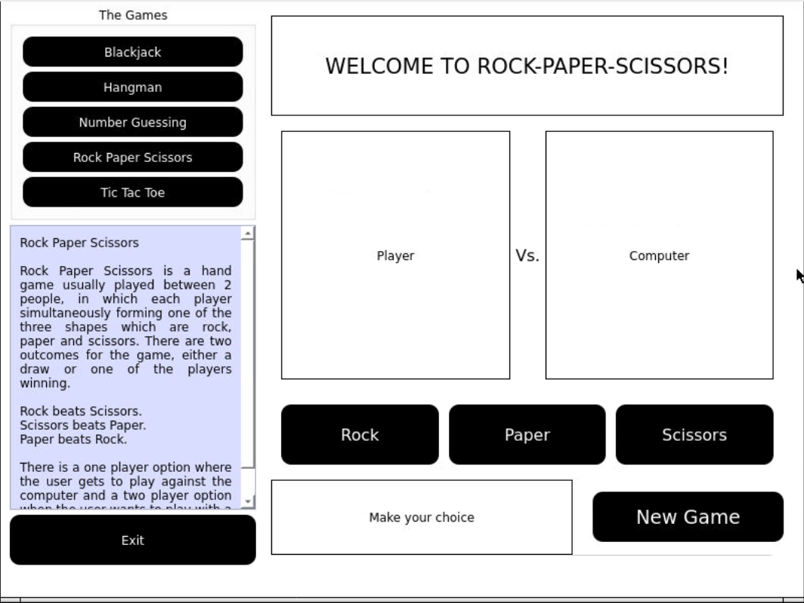
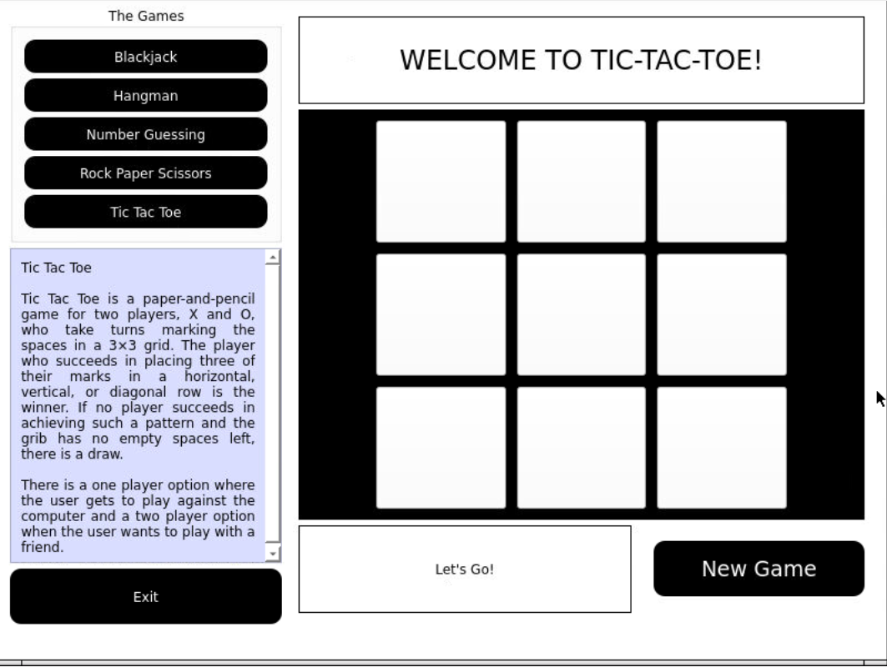

# Python Games
Some popular offline games with an online twist with python. The games are made in 2 formats, the normal command line text-based format, and a graphical user interface format made with the help of PyQt5.

## Check it out for youself
[Run on repl.it!](https://repl.it/@ikathuria/PythonGames)

## What it looks like

